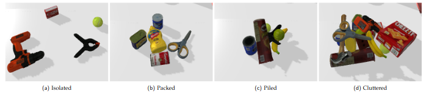

# Target Driven Object Grasping in Highly Cluttered Scenarios through Domain Randomization and Active Segmentation 

This repository contains the implementation of the Artificial Intelligence Master Thesis written by Ivar Mak.

<p align="center">
  
</p>


## Requirements

Ensure you are running Python>=3.6.5 and import the required libraries by running:

```bash
cd ~
git clone https://github.com/ivarmak/clutter-grasping.git
cd ~/clutter-grasping
python3 -m pip install --upgrade pip
pip3 install -r requirements.txt
```

Furthermore, your .bashrc file needs to be edited.

```bash
cd ~
gedit .bashrc
```
and then add the following lines at the end of your .bashrc file

```sh
#This line is necessary for MoveIt! and Pybullet, otherwise the robot seems broken
export LC_NUMERIC="en_US.UTF-8"
```

close all your terminals and open one. 

## How to run experiments
We can perform a simulation experiment by running the 'simulation.py' script. As shown in the following image, we can perform experiments in four different grasping scenarios, including isolated, packed, piled, and cluttered scenarios:

<p align="center">
  
</p>


```bash
cd ~/clutter-grasping

```

## Sources

This project uses adapted content from the following repositories:

Simulation Environment:
[Cognitive Robotics](https://github.com/SeyedHamidreza/cognitive_robotics_manipulation)

Object Detection:
[Mask RCNN](https://github.com/SriRamGovardhanam/wastedata-Mask_RCNN-multiple-classes) - [Original Implementation](https://github.com/matterport/Mask_RCNN)

Grasping:
[GR-ConvNet](https://github.com/skumra/robotic-grasping) - [GG-CNN](https://github.com/dougsm/ggcnn)

Used in training stage of Mask RCNN:
[ImgAug](https://github.com/aleju/imgaug) - [COCO API](https://github.com/cocodataset/cocoapi)
